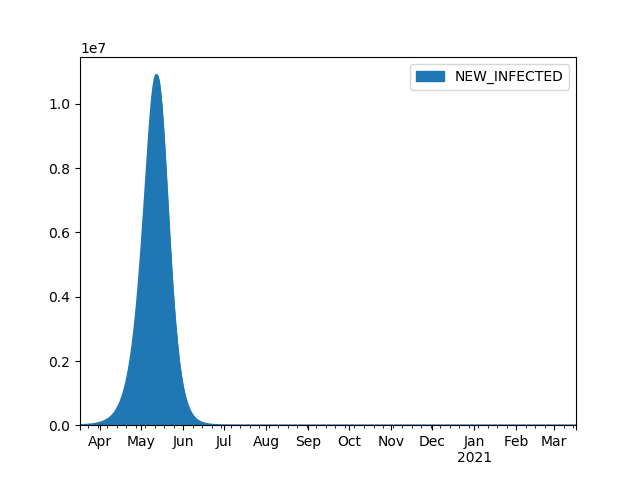
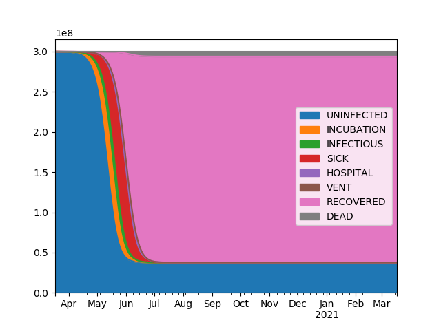

# Covid Model - Introduction and Purpose
This is designed to be a dead simple, accesible-to-anyone, quick-and-dirty model of coronavirus for use in estimating viral spread in response to r0 changes and consequent effects of the medical system.  It draws a disease course at time of infection and plays out that disease course. It should be easy to add mortality conditioned on healthcare demand, to add r0 reduction from NPIs, to test effects of asymptomatic individuals, etc. The assumptions are designed to be reasonable based on the linked studies.

# Baseline Assumptions
## Simplifications:
* Homogenous population
* Deterministic Model (for now)
* Homogenous healthcare system (for now)
* No Reinfection or Resurrections
* Timing medians are very near averages.
* Deaths only occur in critical pool.
* Homogenous Incubation Period (please send info on this!)
* Asymptomatic people don't infect [(This is wrong!)](https://www.medrxiv.org/content/10.1101/2020.02.20.20025866v2)
* Spread happens while in incubation or while sick
## Disease Characteristics
* Basic Reproductive Number, R0 = [2.28](https://www.ijidonline.com/article/S1201-9712(20)30091-6/fulltext)
* Case Fatality Rate = [2.3](https://jamanetwork.com/journals/jama/fullarticle/2762130)
## Disease Course
### Incubation 
* [5 Days](https://www.jwatch.org/na51083/2020/03/13/covid-19-incubation-period-update)
### [Severity](https://jamanetwork.com/journals/jama/fullarticle/2762130)
* Mild = 81%
* Severe = 14%
* Critical = 5%
### [Mild Course](https://www.who.int/docs/default-source/coronaviruse/who-china-joint-mission-on-covid-19-final-report.pdf)
* 14 Days
### [Serious Course](https://www.thelancet.com/journals/lancet/article/PIIS0140-6736\(20\)30566-3/fulltext)
* [30 Days Overall](https://www.who.int/docs/default-source/coronaviruse/who-china-joint-mission-on-covid-19-final-report.pdf)
* Hospitalized Day 7
* Released Day 22
### [Critical Course](https://www.thelancet.com/journals/lancet/article/PIIS0140-6736\(20\)30566-3/fulltext)
* [30 Days Overall](https://www.who.int/docs/default-source/coronaviruse/who-china-joint-mission-on-covid-19-final-report.pdf)
* Hospitalized Day 7
* On Vent Day 12
* Off Vent Day 19
* Released Day 22
### Dead
* Hospitalized Day 7
* On Vent Day 12
* Dead Day 19
# Sample Results
|  |
| :--: | 
|  |
| :--: | 

This should not be considered an actuarial model for purposes of ASOP41.
